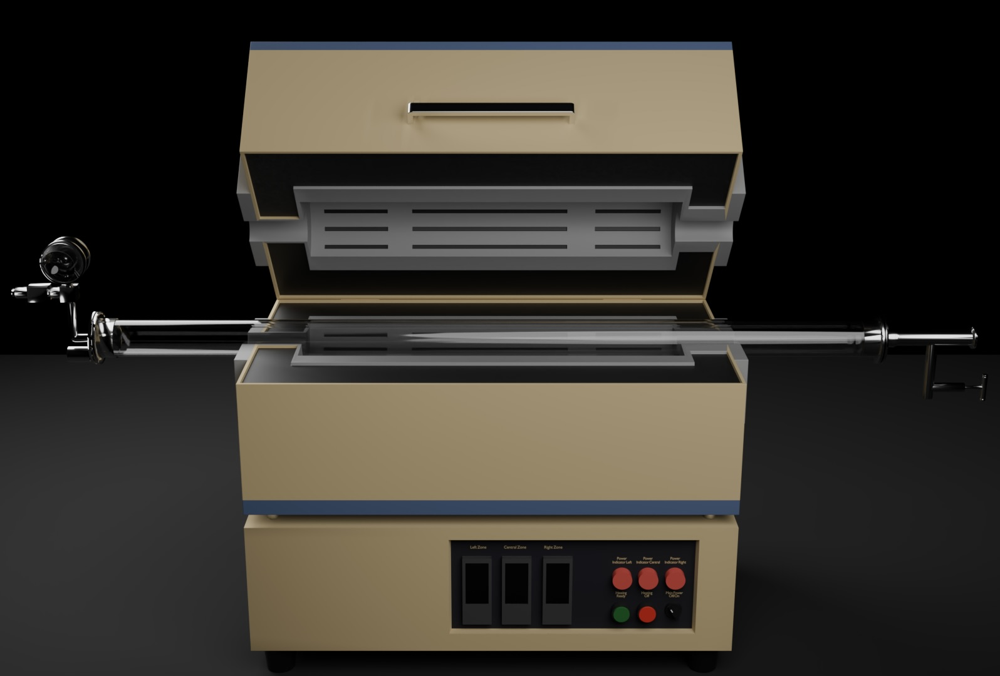
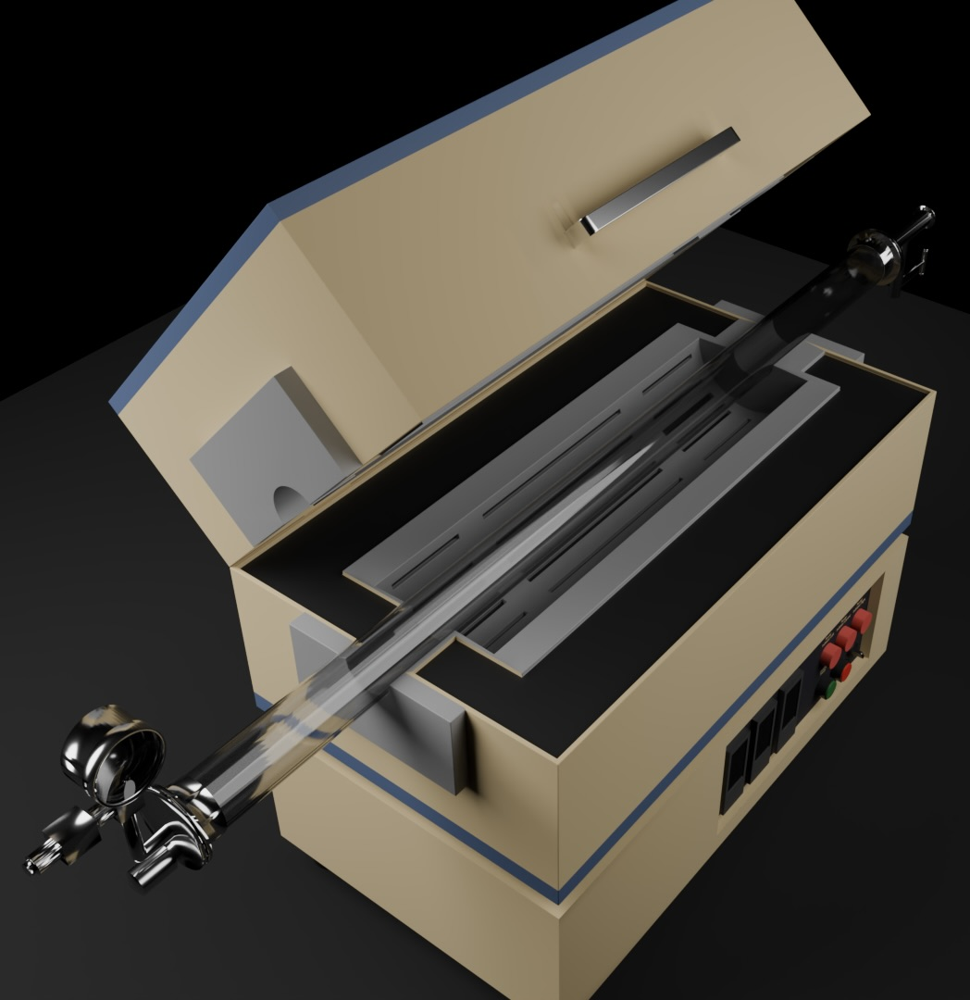
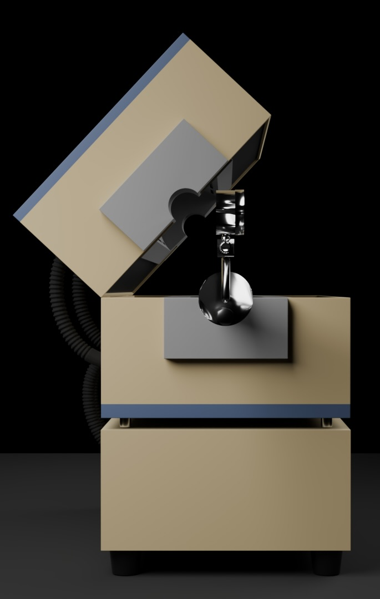

# lab-space-vr

## Split Tube Furnace — 3D Model Previews

Below are three views of the **split tube furnace** model (built for Blender → Unity/VR). 

---

### Front View

*Three-zone heater liners and the quartz tube passing through the furnace body.  
Control panel with zone selectors and indicators is visible on the lower front panel.  
Left/right ends show the flange hardware and tube supports.*

---

### Isometric View

*Angled perspective showing the overall form factor, the split-lid cut-outs, and the tube path.*

---

### Side View

*Side profile with the lid raised showing the hinge motion and feedthrough cut-out alignment.*

### Simple Simulated NanoWire Growth

Inital parameters used: 1. Radius, 2. Temperature, 3. Required Height (of the Nanowire)

*The used scale for is meters for better visualization*
